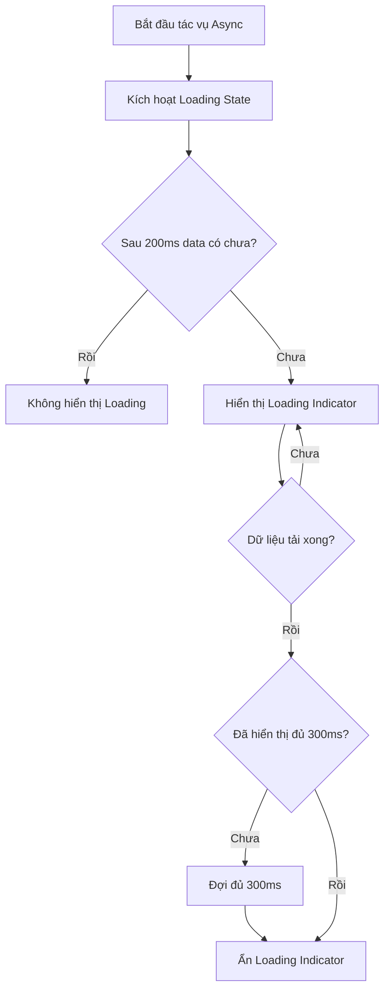

# Spec: Loading Indicator

## 1. Executive Summary
Hệ thống cần một Loading Indicator tinh tế, linh hoạt để sử dụng thay cho những đoạn chữ "Loading..." hoặc spinner thô sơ hiện tại. Indicator này sẽ áp dụng các UX pattern tốt nhất: tránh flash màn hình bằng cách đợi một khoảng delay ngắn (200ms) trước khi hiển thị, và một khi hiển thị sẽ giữ trên màn hình đủ lâu (ít nhất 300ms) để mắt kịp nhận diện, tránh nhấp nháy.

## 2. User Stories
- Là một người dùng, khi tôi click tải danh sách bệnh nhân và mạng nhanh, tôi muốn không bị nháy màn hình bởi một cái spinner chớp nhoáng.
- Là một người dùng, khi dữ liệu tải chậm, tôi muốn thấy giao diện Skeleton cho tôi biết cấu trúc của dữ liệu sắp xuất hiện (bảng, danh sách), giúp tôi cảm thấy hệ thống đang tải một cách chắc chắn và không bị giật (layout shift).
- Là một lập trình viên, tôi muốn có một hook `useLoadingState` và component `<Loading />` dễ tái sử dụng, truyền ít prop nhưng hiệu quả, bao gồm hỗ trợ tốt accessibility.

## 3. UI Components
- **Loading Component**
  - Props: `variant` ('spinner', 'skeleton', 'shimmer', 'bar'), `size`, `delay`, `minDuration`, `className`, `ariaLabel`.
  - Behavior: Internal timers quản lý delay xuất hiện và khóa duration hiển thị.
- **useLoadingState Hook**
  - Quản lý state boolean cho các fetch / async action.

## 4. Scheduled Tasks
- N/A

## 5. Third-party Integrations
- N/A

## 6. Logic Flowchart

## 7. Hidden Requirements
- Phải hỗ trợ `prefers-reduced-motion` trong CSS, nếu user bật chế độ này ở OS, tắt hiệu ứng shimmer/spin chuyển sang fallback tĩnh.
- Cần dọn dẹp các `setTimeout` trong useEffect khi component bị unmount đột ngột.

## 8. Tech Stack
- React 18+ (Next.js)
- Tailwind CSS
- Vitest / React Testing Library

## 9. Build Checklist
- [ ] Thiết kế kiến trúc component.
- [ ] Implement UI (4 variants).
- [ ] Implement Logic UX (delay + minDuration).
- [ ] Tích hợp vào tối thiểu 3 view chính.
- [ ] Viết test cover logic timer.
- [ ] Cập nhật tài liệu nội bộ.
