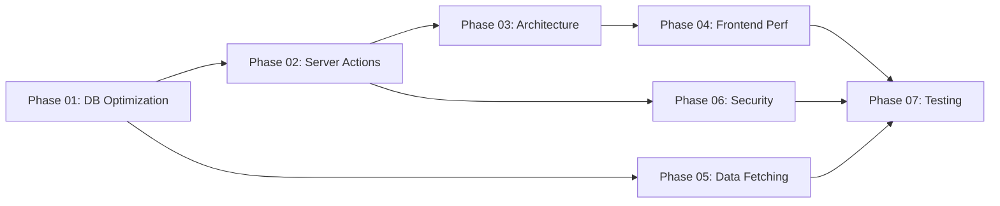

# Plan: Performance & Architecture Bugfix - QLPK-SaaS
Created: 2026-04-26 10:25
Status: 🟡 In Progress
Sources: `tonghop.md`, `performace.md`

## Overview
Sửa toàn bộ các lỗi performance, architecture anti-patterns, và security vulnerabilities đã được phát hiện trong hai file audit (`tonghop.md` và `performace.md`). Các lỗi được xác minh qua source code thực tế.

## Tech Stack
- Frontend: Next.js 16 (App Router), React 19, Recharts, TailwindCSS 4
- Backend: Next.js Server Actions, Supabase RPC
- Database: PostgreSQL (Supabase)
- Validation: Zod v4

## Issue Summary (Verified)

| # | Issue | Severity | File(s) | Verified |
|---|-------|----------|---------|----------|
| 1 | O(N) In-Memory Aggregation | 🔴 CRITICAL | `statistics.ts` | ✅ Tất cả 9 functions đều fetch-all rồi group bằng JS |
| 2 | Client-Side Fetching via Server Actions | 🔴 HIGH | `PatientList.tsx`, `StatisticsClient.tsx` | ✅ `useEffect` gọi Server Actions |
| 3 | Full Table Scan (leading wildcard ILIKE) | 🔴 HIGH | `patients.ts:searchPatients` | ✅ `.ilike.%${term}%` |
| 4 | Unbounded Nested Queries | 🟡 MEDIUM | `patients.ts:getPatientById` | ✅ Fetch tất cả prescriptions không limit |
| 5 | Exact Count overhead | 🟡 MEDIUM | `patients.ts:getPatientsPaginated` | ✅ `count: 'exact'` |
| 6 | N+1 Query pattern (`.in()` array) | 🟡 MEDIUM | `statistics.ts:getMedicineUsageStats` | ✅ Fetch IDs rồi `.in()` |
| 7 | Missing Zod validation | 🔴 HIGH | `patients.ts:addPatient/updatePatient` | ✅ Spread `data` trực tiếp |
| 8 | TOCTOU race condition | 🟡 MEDIUM | `patients.ts:addPatient` | ✅ Check-then-insert |
| 9 | Missing DB UNIQUE constraint | 🟡 MEDIUM | Database schema | ✅ No UNIQUE on patients |
| 10 | Unmemoized form computations | 🟢 LOW | `PrescriptionForm.tsx` | ✅ `calculateSubtotal()` mỗi render |
| 11 | Phantom state (no URL params) | 🟡 MEDIUM | `PatientList.tsx` | ✅ `useState` cho page/search |
| 12 | Bundle bloat (Recharts eager load) | 🟢 LOW | `StatisticsClient.tsx` | ✅ Import tĩnh Recharts |
| 13 | Floating point math | 🟢 LOW | `PrescriptionForm.tsx` | ⚠️ Có nhưng rủi ro thấp (VND) |
| 14 | Lodash full bundle | 🟢 LOW | `package.json` | ⚠️ Cần kiểm tra import |

## Phases

| Phase | Name | Status | Tasks | Priority |
|-------|------|--------|-------|----------|
| 01 | Database Optimization (SQL RPCs + Indexes) | ⬜ Pending | 12 | 🔴 Critical |
| 02 | Server Action Hardening (Zod + Transactions) | ⬜ Pending | 9 | 🔴 High |
| 03 | Next.js Architecture Refactor (Server Components) | ⬜ Pending | 10 | 🔴 High |
| 04 | Frontend Performance (Memo + Dynamic Import) | ⬜ Pending | 8 | 🟡 Medium |
| 05 | Data Fetching Optimization (Pagination + Count) | ⬜ Pending | 7 | 🟡 Medium |
| 06 | Security & Concurrency (Constraints + Races) | ⬜ Pending | 6 | 🟡 Medium |
| 07 | Testing & Verification | ⬜ Pending | 8 | 🟢 Standard |

**Tổng:** 60 tasks | Ước tính: 5-7 sessions

## Quick Commands
- Start Phase 1: `/code phase-01`
- Check progress: `/next`
- Save context: `/save-brain`

## Dependency Graph

## Notes
- Phase 01 là nền tảng - phải hoàn thành trước vì các phase khác phụ thuộc SQL RPCs
- Phase 02 và 03 có thể làm song song một phần
- Phase 07 chạy cuối cùng để verify toàn bộ
- `createPrescription` đã dùng RPC (`create_prescription`) ✅ - không cần sửa

## Audit Findings (2026-04-26)
Plans đã được cross-reference với database backup thực tế (`Supabase Database/`):
- ✅ Phase 01 RPCs: 100% match schema
- ⚠️ Column `allergy_notes` KHÔNG tồn tại → đã sửa thành `medical_history`
- ⚠️ `weight` là TEXT (không phải number) → Zod schema đã cập nhật
- ⚠️ `stock_quantity` âm được phép → đã loại Inventory Safety khỏi Phase 06
- ⚠️ `dob` format hỗn loạn → DOB normalize chỉ áp dụng cho date hợp lệ
- ⚠️ 5 cặp patient trùng lặp tìm thấy → liệt kê trong Phase 06
- ⚠️ `phone` có giá trị phi-SĐT → partial index dùng regex filter
